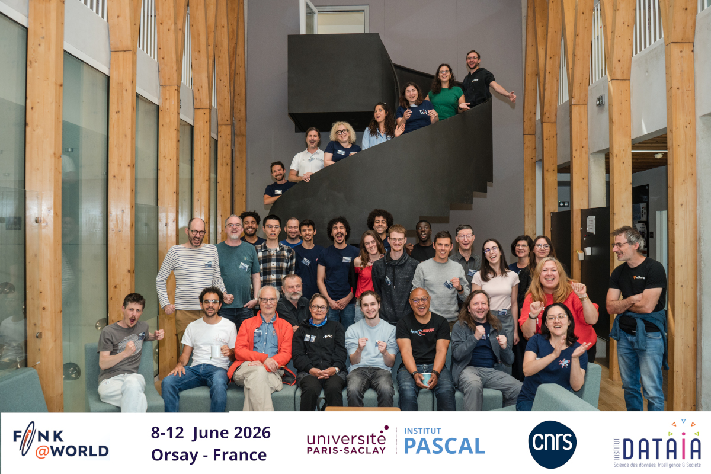

The first world-wide Fink meeting took place at Institut Pascal, Orsay-France, from 8 to 12 June 2026. During 5 days, 35 participants from 3 continents gathered to celebrate our history and plan for the next decade of Rubin observations.
<!--more-->

This is the first time the world-wide Fink collaboration met in the history of our project! In the last years we have done regional meetings in  France ([Annecy 2022](https://indico.in2p3.fr/event/26707/), [Orsay 2024](https://indico.in2p3.fr/event/30789/), [Clermont Ferrand 2025](https://indico.in2p3.fr/event/36303/)), with the goal of tightening the ties between its European members.

As the project grew, similar events were held in Australia ([2023](https://www.afran.org.au/single-post/follow-up-on-the-ozfink-workshop) and [2025](https://indico.in2p3.fr/event/37156/)) and Brazil ([2024](https://indico.in2p3.fr/event/31068/)). These gave domain experts the opportunity to directly interact with the development team in a familiar environment, and were crucial to sustain the collaboration in its infancy.

Nevertheless, the time had come to bring together, for the first time live, Fink members from all corners of the Earth, just in time after the [newly released Rubin alerts](https://fink-broker.org/news/2026-02-26-first-alerts/). The [Fink@World Workshop](https://indico.in2p3.fr/event/38946/) was the first opportunity for the collaboration to meet after the release of Rubin data. Participants came from Australia, Brazil, Czech Republic, France, Germany, New Zealand, Poland and Sweden.

The agenda consisted of tutorials, contributed talks and discussion sessions from a large range of science cases already present in Fink, as well as connections with some other projects also aimed at providing access to public transient astronomy data ([AstroColibri](https://astro-colibri.science/), [BHTOM](https://bh-tom2.astrouw.edu.pl/), [GRANDMA](https://grandma.ijclab.in2p3.fr/) and [KilonovaCatcher](http://kilonovacatcher.in2p3.fr/)).

Beyond the scientific activities, we had a happy hour hosted at Institut Pascal and the opportunity to get inspired by the finest work of art with a visit and dinner at Musée d’Orsay.

Materials from all sessions and pictures can be found at the website: [https://indico.in2p3.fr/event/38946/overview](https://indico.in2p3.fr/event/38946/overview )

We thank our sponsors for making this possible: [Institut Pascal](https://www.institut-pascal.universite-paris-saclay.fr/), [CNRS-IN2P3](https://www.in2p3.cnrs.fr/en)  and [Institut DataIA](https://www.dataia.eu/).
